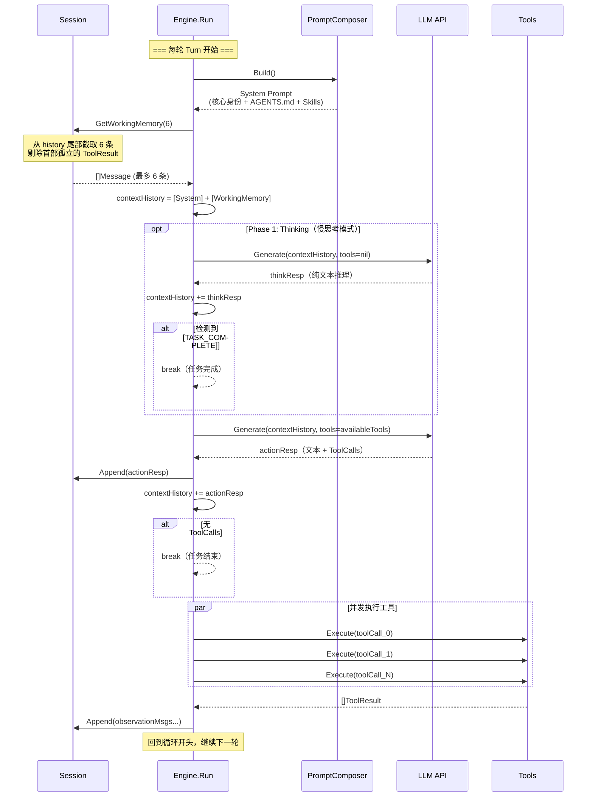
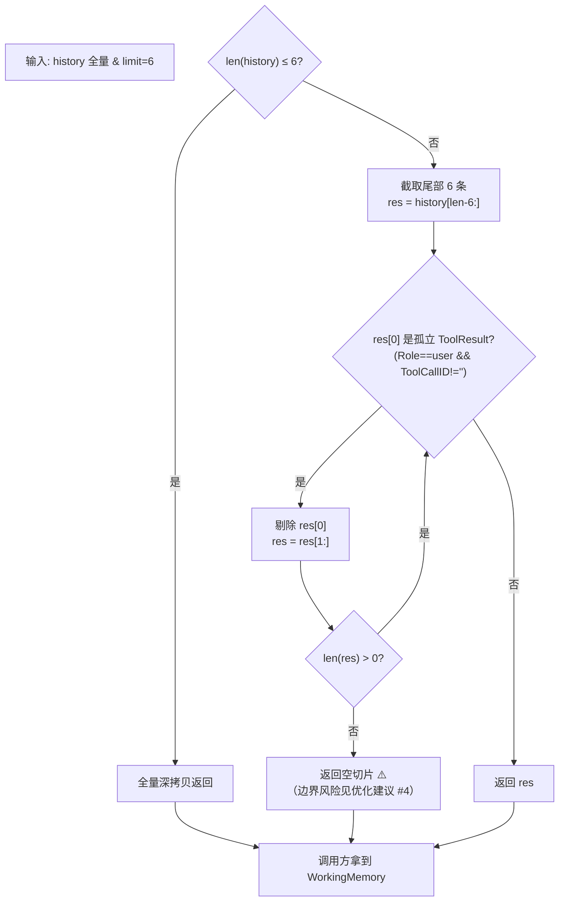

# session.go 优化建议

> 基于真实生产场景（飞书多群机器人、长对话、并发隔离）的代码审查，按严重程度排序。

---

## 1. Session 无过期淘汰机制（严重）

**现状**：`GlobalSessionMgr.sessions` 只增不减，每个飞书群聊创建一个 Session 后就永远驻留内存。

**真实问题**：飞书机器人接入 500 个群聊 → 500 个 Session → 每个 Session 的 history 随时间无限增长 → 最终 OOM。

**建议**：
- 增加 TTL 过期策略：Session 超过 N 分钟无 `Append` 操作自动清理
- 增加最大 Session 数量上限，超出时 LRU 淘汰最不活跃的
- 后台 goroutine 定时扫描清理过期 Session（建议 30 分钟 TTL，扫描间隔 5 分钟）

---

## 2. History 无限增长，内存泄漏（严重）

**现状**：`Append` 只追加不截断，`history` 数组随时间单调增长。即使 `GetWorkingMemory(6)` 只取最近 6 条，全量历史仍然存在内存中。

**真实问题**：一个用户持续对话 2 小时，history 可能积累数千条消息（每轮 turn 产生 tool_call × N + tool_result × N + assistant response）。这些旧消息永远不会被读取，纯浪费内存。

**建议**：
- 在 `Append` 内部加入 history 容量上限（如 200 条），超出时自动裁剪头部
- 裁剪时复用 `GetWorkingMemory` 的孤儿检测逻辑，避免截出孤立 ToolResult
- 或者分离"工作记忆窗口"与"持久化归档"：内存只保留窗口，全量异步刷盘

---

## 3. 缺少持久化，进程重启丢失全部会话（高）

**现状**：代码中注释了 `// s.SaveToDisk()` 占位，但未实现。所有会话历史纯内存存储。

**真实问题**：服务部署重启或崩溃后，所有用户的对话上下文全部丢失。用户在飞书群里说"继续刚才的任务"，Agent 完全不记得。

**建议**：
- 以 JSONL 格式追加写入 `<workDir>/.claw/sessions/<session_id>.jsonl`
- 写入时机：在 `Append` 中异步写（不阻塞主流程），或每个 turn 结束时批量刷盘
- 启动时从磁盘恢复：`GetOrCreate` 先检查磁盘是否有存档
- 配合第 1 点的 TTL，磁盘上的过期会话文件也应定期清理

---

## 4. GetWorkingMemory 的空切片边界情况（中）

**现状**：line 67-73 的孤儿检测循环会持续剥离首条孤立的 ToolResult。如果截取的 N 条消息全部是 ToolResult（极端场景），会返回空切片。

**真实问题**：返回空 `[]Message{}` 后，`loop.go` 只拼了 System Prompt 就发给 LLM，没有用户消息。部分 LLM API 会直接 400 报错（"messages 数组必须包含至少一条 user 消息"）。

**建议**：
- 返回空切片时，回退到取最近一条非孤儿消息（至少保证有一条 user 级别的消息）
- 或者在 `loop.go` 调用侧增加防御：如果 workingMemory 为空，不发起 Generate 请求，改为向用户回复"对话历史已丢失，请重新描述你的需求"

---

## 5. 基于消息条数而非 Token 数做窗口限制（中）

**现状**：`GetWorkingMemory(6)` 按消息条数截断，但单条消息可能是读取了 5000 行的源代码文件（token 量巨大）。

**真实问题**：LLM 的 context window 是按 token 计费的（DeepSeek 128K、Claude 200K）。6 条消息如果全是 read_file 返回的大文件内容，可能已经超出 context window，API 直接报错或静默截断前面的 System Prompt。

**建议**：
- 引入 token 估算函数（粗略按 `len(content)/4` 或使用 tiktoken-go 精确计数）
- `GetWorkingMemory` 改为基于 token 预算（如最多占用 100K tokens），而非固定条数
- System Prompt 和 tools definition 也要纳入 token 预算计算

---

## 6. GetOrCreate 的锁粒度问题（中）

**现状**：`SessionManager.GetOrCreate` 全程持写锁，包括 `NewSession` 的初始化。

**真实问题**：将来如果 `NewSession` 需要从磁盘加载历史（见第 3 点），持写锁期间所有其他 session 的读取都会被阻塞。高并发下（飞书事件回调是并发的），这会成为性能瓶颈。

**建议**：
- 采用 double-checked locking 模式：先用读锁查，miss 时释放读锁、加写锁、再查一次、最后创建
- 创建 session 的耗时操作（如磁盘 IO）在加锁之前完成，加锁只做 map 插入

```go
// 伪代码示意
sm.mu.RLock()
sess, ok := sm.sessions[id]
sm.mu.RUnlock()
if ok { return sess }

newSess := NewSession(id, workDir) // 耗时的初始化在锁外

sm.mu.Lock()
if sess, ok := sm.sessions[id]; ok { return sess } // 二次检查
sm.sessions[id] = newSess
sm.mu.Unlock()
```

---

## 7. GlobalSessionMgr 全局单例不利于测试和多实例（低）

**现状**：`var GlobalSessionMgr = &SessionManager{...}` 是包级可变全局变量。

**真实问题**：
- 单元测试之间会互相污染（test A 创建的 session 可能被 test B 读到）
- 如果未来需要在一个进程内运行两套独立的 Agent 系统（如不同的飞书应用），它们被迫共享 session 状态

**建议**：
- `GlobalSessionMgr` 改为通过依赖注入传入 Engine，而非包级变量
- 或者至少提供 `NewSessionManager()` 构造函数，`GlobalSessionMgr` 只作为便捷默认值
- 测试中使用 `NewSessionManager()` 创建隔离实例

---

## 8. 缺少 Session 删除/关闭方法（低）

**现状**：`SessionManager` 只有 `GetOrCreate`，没有 `Remove` 或 `Close`。

**真实问题**：飞书群聊解散、用户主动结束会话等场景下，无法主动释放资源。只能等 TTL 过期（见第 1 点）被动清理。

**建议**：
- 增加 `SessionManager.Remove(id string)` 方法
- 删除前先调 `Session.Close()` 刷盘最后一波未持久化的消息
- 与飞书事件联动：收到群解散事件 → 主动 Remove 对应 Session

---

## 9. Working Memory 窗口大小硬编码在调用方（低）

**现状**：`session.GetWorkingMemory(6)` 的窗口大小 `6` 硬编码在 `loop.go:58`。Session 自身不知道自己的记忆窗口应该多大。

**真实问题**：不同场景需要不同窗口——代码审查可能需要保留最近 10 条，简单问答 4 条就够。窗口大小应该随 Session 的属性变化，而非全局统一。

**建议**：
- 给 Session 增加 `MemoryLimit int` 字段，创建时根据场景设定（默认值 6）
- `GetWorkingMemory()` 无参，内部读 `s.MemoryLimit`
- 或者在 Session 创建时通过 `Functional Option` 模式传入

---

## 10. Append 后无 UpdatedAt 的持久化语义保证（低）

**现状**：`UpdatedAt` 只在内存中更新，进程重启后丢失。

**真实问题**：如果实现了持久化（第 3 点），重启后无法判断哪个 session 是"活跃的"（需要恢复），哪个已经过期。

**建议**：
- 持久化时把 `UpdatedAt` 也写入磁盘元数据
- 恢复时根据 `UpdatedAt` + TTL 判断是否跳过已过期 session

---

## 优先级总结

| 优先级 | 条目 | 影响 |
|--------|------|------|
| **P0** | #1 Session 过期淘汰 | 长期运行必然 OOM |
| **P0** | #2 History 上限截断 | 长期运行必然 OOM |
| **P1** | #3 持久化 | 重启丢失上下文，用户体验差 |
| **P1** | #4 空切片边界 | API 400 错误，偶发但影响功能 |
| **P1** | #5 Token 预算 | 大文件场景 API 报错 |
| **P2** | #6 锁粒度 | 高并发下性能退化 |
| **P2** | #7 全局单例 | 测试困难 |
| **P3** | #8-#10 | 锦上添花 |

---

# 上下文管理机制详解

## 整体架构

上下文管理由三层组件协作完成：

| 组件 | 文件 | 职责 |
|------|------|------|
| **Session** | `internal/context/session.go` | 持有会话的完整历史，提供滑动窗口截取 |
| **PromptComposer** | `internal/context/composer.go` | 根据工作区动态生成 System Prompt |
| **AgentEngine.Run** | `internal/engine/loop.go` | 每轮 turn 组装上下文、调用 LLM、写回历史 |

```mermaid
flowchart TB
    subgraph 外部入口
        FEISHU[飞书消息/CLI]
    end

    subgraph SessionManager
        SM[GlobalSessionMgr]
        S1[Session A<br/>history: []Message]
        S2[Session B<br/>history: []Message]
        SM --> S1
        SM --> S2
    end

    subgraph Engine
        RUN[AgentEngine.Run]
        PC[PromptComposer<br/>读取 AGENTS.md + Skills]
        WM[GetWorkingMemory<br/>滑动窗口截取]
    end

    subgraph LLM
        API[DeepSeek / Claude API]
    end

    FEISHU -->|"GetOrCreate(chatId, workDir)"| SM
    FEISHU -->|"session.Append(userMsg)"| S1
    FEISHU -->|"eng.Run(session, reporter)"| RUN

    RUN -->|"1. 生成 System Prompt"| PC
    PC -->|"读取"| DISK[(工作区磁盘<br/>AGENTS.md / .claw/skills/)]
    RUN -->|"2. session.GetWorkingMemory(6)"| WM
    WM -->|"截取最近 6 条"| S1
    RUN -->|"3. System + WorkingMemory → API"| API
    API -->|"4. 回复 & ToolCalls"| RUN
    RUN -->|"5. session.Append(resp + obs)"| S1
```

## 单轮 Turn 详细流程



## GetWorkingMemory 滑动窗口算法

这是整个上下文管理的核心——从 Session 的全量 history 中截取"短期工作记忆"。



**孤儿消息示例**：

```
history = [
  [0] User: "读 README.md"
  [1] Assistant: ToolCall(id=call_1, name=read_file)
  [2] User: "文件内容: SECRET_KEY=abc123", ToolCallID=call_1  ← 正常，前面有 call_1
  [3] Assistant: ToolCall(id=call_2, name=write_file)
  [4] User: "写入成功", ToolCallID=call_2                     ← 正常，前面有 call_2
  [5] User: "天气查询结果: 晴天", ToolCallID=call_3           ← 孤儿！call_3 的 ToolCall 在第 [0] 之前已被截断
]

GetWorkingMemory(6) → 取尾部 6 条 → 下标 [0]~[5]
  → [0] 是 User+ToolCallID=call_1，但 call_1 的 Assistant 消息在 history 中 → NOT 孤儿
  → 等等... 这里下标 [0] 是 User: "读 README.md"，Role=User 但 ToolCallID=""
  → RoleUser + ToolCallID=="" → 不算孤儿，保留
```

更典型的孤儿场景：

```
假设 history 有 10 条消息，limit=4：
history = [
  ...
  [5] Assistant: ToolCall(id=call_x, name=read_file)
  [6] User: ToolCallID=call_x → 正常
  [7] Assistant: "不需要更多工具了"
  [8] User: "帮我再查一下天气"
  [9] Assistant: ToolCall(id=call_y, name=get_weather)
]

取尾部 4 条 → history[6:10] = [
  [0'] User: ToolCallID=call_x       ← 孤儿！call_x 的 ToolCall 在 [5] 被截掉了
  [1'] Assistant: "不需要更多工具了"
  [2'] User: "帮我再查一下天气"
  [3'] Assistant: ToolCall(id=call_y)
]
→ 剥离 [0'] → 返回剩下 3 条
```

## 全量上下文的一次实际组装

以 `main.go` 中的模拟场景为例，看 Session A 第一轮 turn 时的完整上下文：

```mermaid
flowchart LR
    subgraph 发往 LLM 的 contextHistory
        direction TB
        SYS["🔵 System: 核心身份 + 纪律 + AGENTS.md"]
        U1["🟢 User: 帮我看看 README.md 里记录了什么密钥？"]
    end

    subgraph 被截断丢弃
        DUMMY["... 6 条闲聊消息 ..."]
    end

    subgraph Session.history 全量
        direction TB
        H0["User: 帮我看看 README.md"]
        H1["Assistant: ToolCall(read_file)"]
        H2["User: SECRET_KEY=abc123 (ToolCallID=...)"]
        H3["User: 闲聊占位符"]
        H4["Assistant: 好的收到闲聊"]
        H5["... × 6 条 ..."]
    end

    Session.history -->|"GetWorkingMemory(6)"| 发往 LLM 的 contextHistory
```

第一轮只有用户消息，WorkingMemory 不足 6 条就全量返回。随着对话推进，history 增长超过 6 条后，GetWorkingMemory 开始裁剪旧消息，这就是 main.go 中"用闲聊刷掉密钥记忆"的工作原理——6 轮闲聊后，包含密钥的工具结果已被挤出 WorkingMemory 窗口，第二轮 Turn 时模型自然"忘记"了密钥。

## 关键设计决策

| 决策 | 做法 | 权衡 |
|------|------|------|
| Working Memory 窗口 | 6 条消息 | 省 token，但大文件可能一条就爆 context window |
| 孤儿消息处理 | 剥离首部孤立 ToolResult | 防 API 400，但极端情况可能返回空切片 |
| System Prompt 生成 | 每轮 Turn 动态组装 | 总是最新的，但重复读取磁盘 |
| 全量历史 vs 窗口 | 内存保留全量，API 只发窗口 | API 省 token，但内存持续增长 |
| Session 隔离 | 按 chatId/自定义 ID | 多群隔离，但 ID 冲突风险由调用方承担 |
